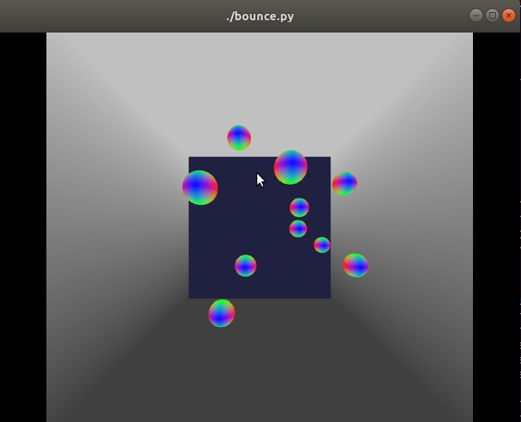

This is me playing with OpenGL, Pyglet, and Numpy.
You'll likely need to 'pip3 install' or otherwise grab:

* PyOpenGL
* PyOpenGL_accelerate
* pyglet
* PyMCubes
* scipy

It bounces a bunch of balls around a box and computes the field around the balls
as if they were [non-interacting] charged particles.

Keys it understands:
* c: Generate a marching-cubes outline of the field.
* v: Generate a voxel-based outline of the field.
* b: Generate both kinds of outlines simultaneously.
* d: Toggle display of the last marching-cubes outline on or off.
* e: Toggle display of the last voxel outline on or off.
* q: Quit

Currently the calculation of the field is quite slow; I'm looking into how I
might use multiple cores to speed it up, as I've done with other python
projects, but that'll have to wait until I've got a bit more time.

