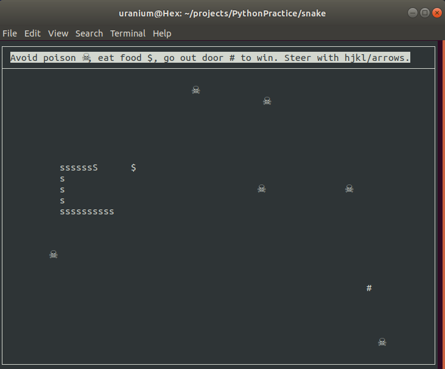

This is a classic snake-style game using the [curses
library](https://en.wikipedia.org/wiki/Curses_(programming_library)).

_Curses doesn't work on Windows without a lot of effort, so this won't either.
Try it on Linux or Mac or you're on your own._

* Use hjkl or arrow keys to steer or q to exit.
* Your score is the length of your snake when you go out the door.
* Eat food ($) to get longer.
* Avoid the poison.
* Don't run into a wall or bite yourself.

